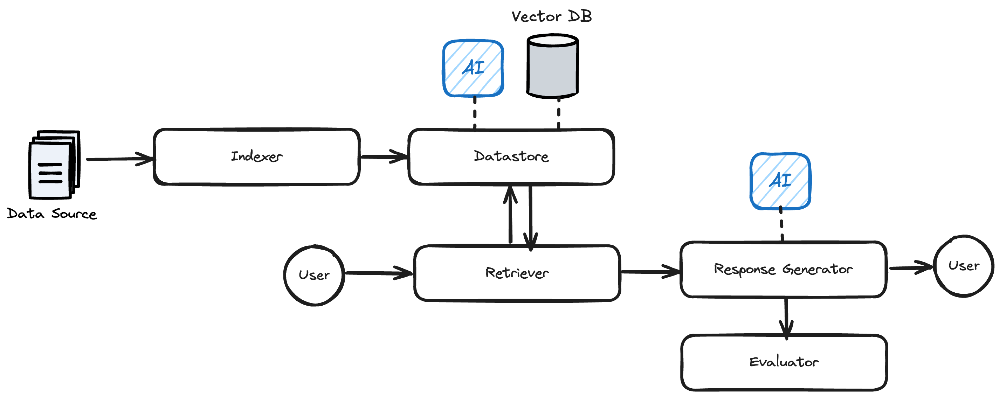

# Simple RAG Pipeline

This project is a beginner-friendly tutorial project for building a Retrieval Augmented Generation (RAG) system. It demonstrates how to index documents, retrieve relevant content, generate AI-powered responses, and evaluate results—all through a command line interface (CLI).



## Overview

The RAG Framework lets you:

- **Index Documents:** Process and break documents (e.g., PDFs) into smaller, manageable chunks.
- **Store & Retrieve Information:** Save document embeddings in a vector database (using LanceDB) and search using similarity.
- **Generate Responses:** Use an AI model (via the OpenAI API) to provide concise answers based on the retrieved context.
- **Evaluate Responses:** Compare the generated response against expected answers and view the reasoning behind the evaluation.

## Architecture

- **Pipeline (src/rag_pipeline.py):**  
  Orchestrates the process using:

  - **Datastore:** Manages embeddings and vector storage.
  - **Indexer:** Processes documents and creates data chunks. Two versions are available—a basic PDF indexer and one using the Docling package.
  - **Retriever:** Searches the datastore to pull relevant document segments.
  - **ResponseGenerator:** Generates answers by calling the AI service.
  - **Evaluator:** Compares the AI responses to expected answers and explains the outcome.

- **Interfaces (interface/):**  
  Abstract base classes define contracts for all components (e.g., BaseDatastore, BaseIndexer, BaseRetriever, BaseResponseGenerator, and BaseEvaluator), making it easy to extend or swap implementations.

## Installation

#### Set Up a Virtual Environment (Optional but Recommended)

```bash
python3 -m venv venv
source venv/bin/activate
# On Windows:
venv\Scripts\activate
```

#### Install Dependencies

```bash
pip3 install -r requirements.txt
```

#### Configure Environment Variables

We use OpenAI for the LLM (you can modify/replace it in `src/util/invoke_ai.py`). Make sure to set your OpenAI API key. For example:

```sh
export OPENAI_API_KEY='your_openai_api_key'
```

You will also need a Cohere key for the re-ranking feature used in `src/impl/retriever.py`. You can create an account and create an API key at https://cohere.com/

```sh
set -x CO_API_KEY "xxx"
```

## Usage

The CLI provides several commands to interact with the RAG pipeline. By default, they will use the source/eval paths specified in `main.py`, but there are flags to override them.

```python3
DEFAULT_SOURCE_PATH = "sample_data/source/"
DEFAULT_EVAL_PATH = "sample_data/eval/sample_questions.json"
```

#### Run the Full Pipeline

This command resets the datastore, indexes documents, and evaluates the model.

```bash
python3 main.py run
```

#### Reset the Database

Clears the vector database.

```bash
python3 main.py reset
```

#### Add Documents

Index and embed documents. You can specify a file or directory path.

```bash
python3 main.py add -p "sample_data/source/"
```

#### Query the Database

Search for information using a query string.

```bash
python3 main.py query "What is the opening year of The Lagoon Breeze Hotel?"
```

#### Evaluate the Model

Use a JSON file (with question/answer pairs) to evaluate the response quality.

```bash
python3 main.py evaluate -f "sample_data/eval/sample_questions.json"
```
